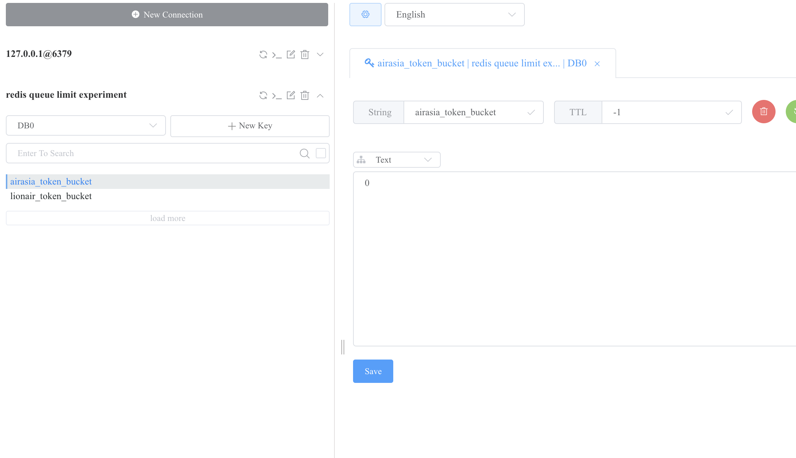
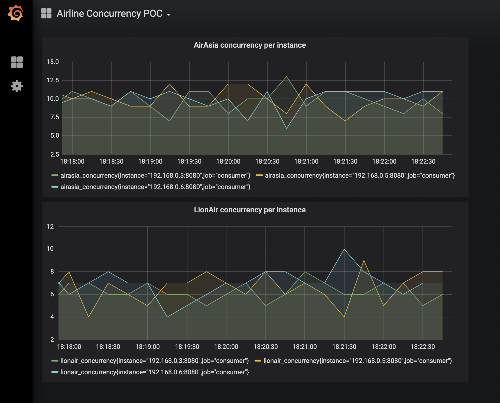

## Redis-backed Distributed Job Queue w/ Rate Limiter

A proof-of-concept to show how redis is a viable option for the following use case:

- distributed queue / job scheduler
- controlled outgoing calls via semaphores

## Running load tests and observing concurrency

1. Install [k6](https://k6.io/docs/getting-started/installation)
2. Run the entire setup, with 3 consumers - `docker-compose up --scale consumer=3`
3. Run the loadtest with (X concurrent users over Y duration) - `k6 run --vus 300 --duration 120s k6.js`
4. Observe the redis token bucket drop to 0:



5. Observe almost equal distribution of load on [grafana](http://localhost:3000/d/_xxCrJRMz/airasia-concurrency?panelId=2&edit&fullscreen&orgId=1&refresh=5s).



6. Observe the queue build up


## Test with postman / cURL

Queue a job:

```
curl --request POST \
  --url http://localhost:8081/queueJob \
  --header 'content-type: application/json' \
  --data '{
	"queueId": "airasia",
	"name": "spec2",
	"score": 2.1
}'
```

Poll for a job:

```
curl --request POST \
  --url http://localhost:8080/pollJob/airasia
```

## WIP

- Pending addition of [pumba](https://github.com/alexei-led/pumba) to simulate failures
- Fix the karate loadtests, somehow its not triggering load in the same behavior as k6
